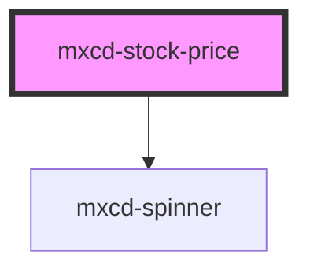

# mxcd-stock-price

<!-- Auto Generated Below -->

## Properties

| Property      | Attribute      | Description                       | Type     | Default     |
| ------------- | -------------- | --------------------------------- | -------- | ----------- |
| `stockSymbol` | `stock-symbol` | Stock Symbol That will Search for | `string` | `undefined` |

## Dependencies

### Depends on

- [mxcd-spinner](../spinner)

### Graph

----------------------------------------------

*Built with [StencilJS](https://stenciljs.com/)*
